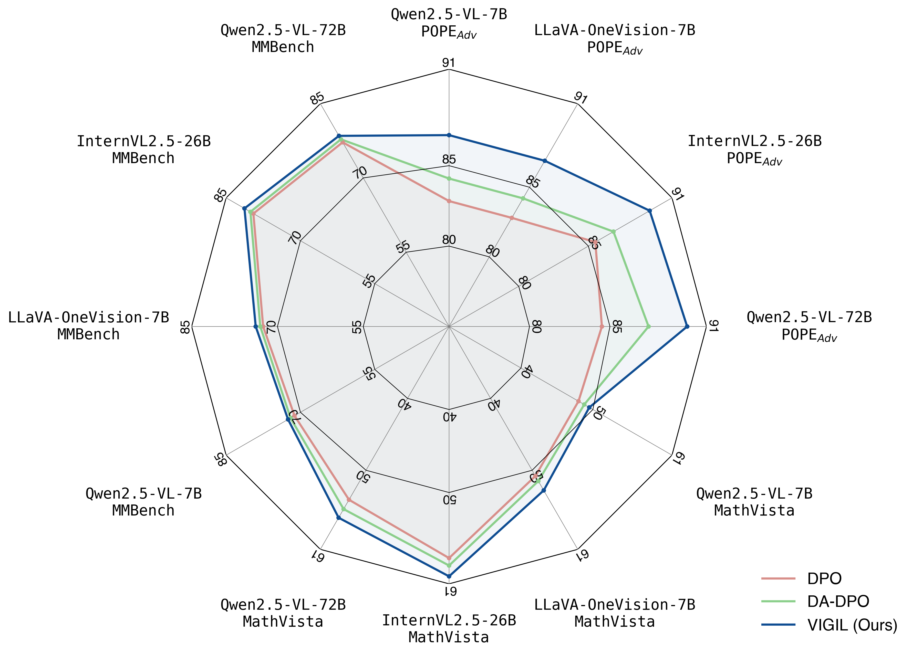

# `nature-figure` 技能

[English](README_EN.md)

`nature-figure` 用于设计、生成和审查投稿级科研图件，面向 Nature 系列、高影响力期刊、论文图版、机制示意图和 graphical abstract 草稿。

## 适合用它做什么

- 根据数据、图注或论文结论生成 Python / R 绘图脚本和可编辑图件。
- 将已有图件重画为更清楚的多面板论文 figure。
- 规划 Figure 1、机制图、workflow、graphical abstract 或补充图。
- 检查面板标签、配色、字体、统计标注、source data 和导出格式。
- 在用户明确要求时，通过 OpenRouter Images API 调用 `openai/gpt-image-2` 生成 AI 概念示意图草稿。

## 工作方式

绘图前先建立图件契约，而不是直接套模板：

- 核心结论：这张图要证明什么。
- 证据层级：哪些面板是主证据，哪些是补充解释。
- 图件原型：散点、箱线、热图、机制图、流程图、多面板组合等。
- 后端选择：Python 或 R；第一次选择后会作为默认偏好复用。
- 数据完整性：默认保留全部观测和指定变量，任何排除都记录规则与前后计数。
- 模板兼容性：先核对科学含义、数据结构和变换条件，再决定精确复用、结构适配或只继承样式。
- 投稿约束：尺寸、字体、色彩、分辨率、矢量格式和 source-data 可追溯性。

## 典型请求

- “把这组数据做成 Nature 风格多面板图，优先 Python。”
- “参考 figures4papers 里 Nature Machine Intelligence 的布局，帮我补一个方法对比图。”
- “重画这个机制示意图，导出 SVG/PDF，并给我 source data 表。”
- “用 OpenRouter 生成 graphical abstract 草稿，但不要当作定量数据图。”

## 示例预览

| 方向 | 预览 | 可借鉴模式 |
|------|------|------------|
| 多面板论文图 |  | 机制示意、图像面板、定量结果和相关性放在同一证据链中 |
| 图表类型 atlas |  | 热图、注释矩阵、聚类块和发散色标的组合模式 |
| figures4papers demo |  | 从真实论文脚本中抽取 layout、legend 和多指标比较语法 |

## 你需要提供

- 原始数据、已有图、图注、论文 claim 或想表达的机制。
- 目标期刊、单栏/双栏尺寸、输出格式和是否需要 source data。
- Python / R 偏好；如果没有偏好，技能会先询问或沿用本机记录。

## 产出

- 可运行的 Python 或 R 绘图脚本。
- SVG/PDF/TIFF/PNG 等图件文件，优先保留可编辑矢量版本。
- 面板说明、source data 映射、排除计数和投稿前 QA 记录。
- AI 示意图任务中，输出概念草稿和需要人工重画/核实的元素列表。

## 内置参考

- `references/api.md`：Python 配色、样式和绘图 helper 约定。
- `references/asset-adaptation.md`：模板语义匹配、字段映射和数据完整性规则。
- `references/template-catalog.md`：volcano、ROC、marker dot plot、marginal 和 paired 的已验证 Python CSV 模板。
- `references/chart-types.md`：常见图型选择和视觉规则。
- `references/demos.md`：`figures4papers` demo 与可借鉴模式。
- `references/qa-contract.md`：导出前检查项、source-data 约束和静态预检入口。
- `scripts/validate_figure.py`：Python/R 绘图源码的可复现静态 QA。
- `assets/figures4papers/`：打包的 demo 脚本与预览图。

## 边界

- 不会把 AI 生成图片当作真实实验结果或定量数据面板。
- 不会凭空补统计检验、样本量、误差线含义或实验条件。
- 不会为了渲染方便静默抽样、忽略变量或删除不完整观测。
- 私有模板可以在本机使用，但不应在面向用户输出中暴露私有路径、文件名或来源。

## 相关技能

- `nature-statistics`：检查统计标注、n 定义和 p 值表述。
- `nature-writing`：把图件结论放回手稿叙事。
- `nature-paper2ppt`：把论文图件整理成汇报幻灯片。

## 与其他技能的关系

- 如果任务核心是统计解释、样本量定义或显著性表述，优先让 `nature-statistics` 先把文字审清，再回到 `nature-figure` 画图。
- 如果图件已经定稿，但需要把结论组织成摘要、引言或结果段落，交给 `nature-writing` 继续承接。
- 如果图件要直接转成组会材料或答辩汇报，再交给 `nature-paper2ppt` 组织成页面。
- `nature-figure` 负责图件本身；它不替代统计审查，也不替代手稿叙事。
